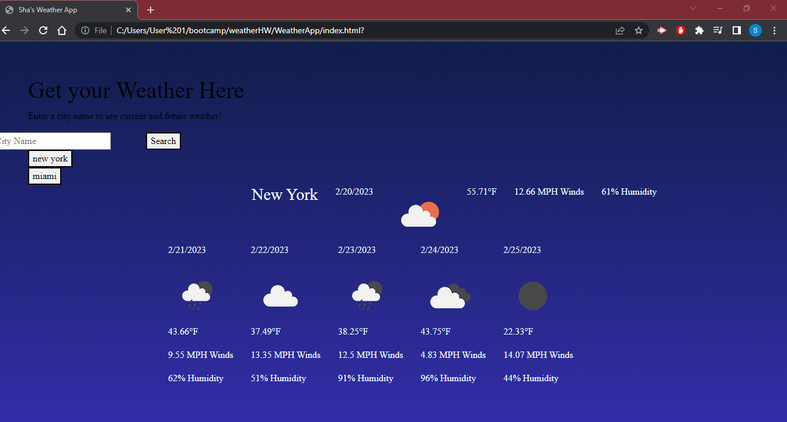

# WeatherApp

## [Deployed Application](https://suzychambers.github.io/WeatherApp/)

## Description

This is a weather dashboard page that shows the current weather for any city around the world, as well as the 5-day forecast. This application uses HTML and CSS dynamically powered by JavaScript.

## Usage

To use this application, enter the name of a city in the search bar. The application will populate with the city's current weather and 5-day forecast. The city will save as a button below the search bar, which can be selected again to re-generate the data.

## Credits

Collaborators: Sha Chambers

## License

This application is covered under the MIT License.
